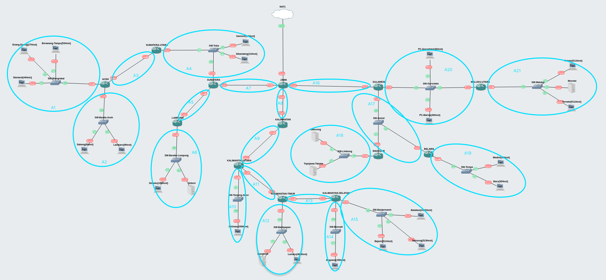
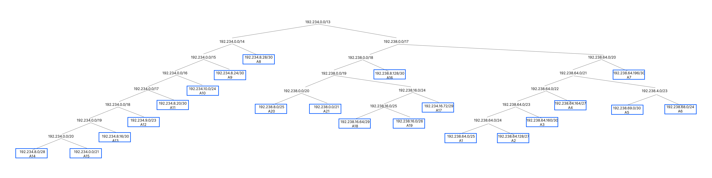

# Jarkom-Modul-4-IT02-2024

Kelompok IT02 :
| Nama | NRP |
| -------------------- | ---------- |
| Samuel Yuma Krismata | 5027221029 |
| Marselinus Krisnawan Riandika | 5027221056 |

## Daftar Isi

[Topologi](#topologi)</br>
[Rute](#rute)</br>
[Area Subnet](#area-subnet)</br>
[CPT VLSM](#cpt-vlsm)</br>
[GNS3 CIDR](#gns3-cidr)</br>

## Topologi


## Rute

| Nama Subnet | Rute                                                                                                                                                          |
| ----------- | ------------------------------------------------------------------------------------------------------------------------------------------------------------- |
| A1          | JAWA > SUMATERA > SW-Toba > SUMATERA-UTARA >SW-Blangrakal > Berawang-Tampu > SW-Blangrakal > Enang-Enang > SW-Blangrakal > Starland                           |
| A2          | JAWA > SUMATERA > SW-Toba > SUMATERA-UTARA > SW-Banda-Aceh > Sabang > SW-Banda-Aceh > Lambaro                                                                 |
| A3          | JAWA > SUMATERA > SW-Toba > SUMATERA-UTARA > ACEH                                                                                                             |
| A4          | JAWA > SUMATERA > SW-Toba > Samosir > SW-Toba > Sibandang > SW-Toba > SUMATERA-UTARA                                                                          |
| A5          | JAWA > SUMATERA > LAMPUNG                                                                                                                                     |
| A6          | JAWA > SUMATERA > LAMPUNG > SW-Bandar-Lampung > Sebuku > SW-Bandar-Lampung > Sebesi                                                                           |
| A7          | JAWA > SUMATERA                                                                                                                                               |
| A8          | JAWA > KALIMANTAN                                                                                                                                             |
| A9          | JAWA > KALIMANTAN > KALIMANTAN-UTARA                                                                                                                          |
| A10         | JAWA > KALIMANTAN > KALIMANTAN-UTARA > SW-Tanjung-Selor > Selimau                                                                                             |
| A11         | JAWA > KALIMANTAN > KALIMANTAN-UTARA > KALIMANTAN-TIMUR                                                                                                       |
| A12         | JAWA > KALIMANTAN > KALIMANTAN-UTARA > KALIMANTAN-TIMUR > SW-Balikpapan > Bangkirai > SW-Balikpapan > Lamaru                                                  |
| A13         | JAWA > KALIMANTAN > KALIMANTAN-UTARA > KALIMANTAN-TIMUR > KALIMANTAN-SELATAN                                                                                  |
| A14         | JAWA > KALIMANTAN > KALIMANTAN-UTARA > KALIMANTAN-TIMUR > KALIMANTAN-SELATAN > SW-Boenati > Angsana                                                           |
| A15         | JAWA > KALIMANTAN > KALIMANTAN-UTARA > KALIMANTAN-TIMUR > KALIMANTAN-SELATAN > SW-Banjarmasin > Bajuin > SW-Banjarmasin > Takisung > SW-Banjarmasin > Batakan |
| A16         | JAWA > SULAWESI                                                                                                                                               |
| A17         | JAWA > SULAWESI > SW-Sulsel > MAKASAR > SW-Sulsel > BELAWA                                                                                                    |
| A18         | JAWA > SULAWESI > SW-Sulsel > MAKASAR > SW-Limbung > Galesong > SW-Limbung > Topejawa-Takalar                                                                 |
| A19         | JAWA > SULAWESI > SW-Sulsel > BELAWA > SW-Tempe > Madini > SW-Tempe > Baru                                                                                    |
| A20         | JAWA > SULAWESI > SW-Gorontalo > PC-Gorontalo > SW-Gorontalo > PC-Marisa > SW-Gorontalo > MALUKU-UTARA                                                        |
| A21         | JAWA > SULAWESI > SW-Gorontalo > MALUKU-UTARA > SW-Maluku > Tobelo > SW-Maluku > Morotai > SW-Maluku > Ternate                                                |

## Area Subnet

| Nama Subnet | Area Subnet                                                       | Jumlah IP | Netmask |
| ----------- | ----------------------------------------------------------------- | --------- | ------- |
| A1          | ACEH - SW-Blangrakal - Berawang-Tampu - Enang-Enang - Starland    | 125       | /25     |
| A2          | ACEH - SW-Banda-Aceh - Sabang - Lambaro                           | 15        | /27     |
| A3          | ACEH - SUMATERA-UTARA                                             | 2         | /30     |
| A4          | SUMATERA-UTARA - SW-Toba - Samosir - Sibandang - SUMATERA         | 27        | /27     |
| A5          | SUMATERA - LAMPUNG                                                | 2         | /30     |
| A6          | LAMPUNG - SW-Bandar-Lampung - Sebuku -Sebesi                      | 188       | /24     |
| A7          | SUMATERA - JAWA                                                   | 2         | /30     |
| A8          | JAWA - KALIMANTAN                                                 | 2         | /30     |
| A9          | KALIMANTAN - KALIMANTAN-UTARA                                     | 2         | /30     |
| A10         | KALIMANTAN-UTARA - SW-Tanjung-Selor - Selimau                     | 201       | /24     |
| A11         | KALIMANTAN-UTARA - KALIMANTAN-TIMUR                               | 2         | /30     |
| A12         | KALIMANTAN-TIMUR - SW-Balikpapan - Bangkirai - Lamaru             | 470       | /23     |
| A13         | KALIMANTAN-TIMUR - KALIMANTAN-SELATAN                             | 2         | /30     |
| A14         | KALIMANTAN-SELATAN - SW-Boenati - Angsana                         | 16        | /28     |
| A15         | KALIMANTAN-SELATAN - SW-Banjarmasin - Bajuin - Takisung - Batakan | 2045      | /21     |
| A16         | JAWA - SULAWESI                                                   | 2         | /30     |
| A17         | SULAWESI - SW-Sulsel - MAKASAR - BELAWA                           | 3         | /29     |
| A18         | MAKASAR - SW-Limbung - Galesong - Topejawa-Takalar                | 3         | /29     |
| A19         | BELAWA - SW-Tempe - Madini - Baru                                 | 61        | /26     |
| A20         | SULAWESI - SW-Gorontalo - PC-Gorontalo - PC-Marisa - MALUKU-UTARA | 64        | /26     |
| A21         | MALUKU-UTARA - SW-Maluku - Tobelo - Morotai - Ternate             | 1024      | /22     |
| Total       |                                                                   | 4258      | /19     |

## CPT VLSM

### Topologi


### Pembagian IP

Prefix IP : **192.234**

| Subnet | Network ID     | Netmask         | Broadcast      | Range IP                        |
| ------ | -------------- | --------------- | -------------- | ------------------------------- |
| A1     | 192.234.20.0   | 255.255.255.128 | 192.23420.127  | 192.234.20.1 - 192.234.20.126   |
| A2     | 192.234.21.128 | 255.255.255.224 | 192.234.21.159 | 192.234.21.129 - 192.234.21.158 |
| A3     | 192.234.21.176 | 255.255.255.252 | 192.234.21.179 | 192.234.21.177 - 192.234.21.178 |
| A4     | 192.234.21.64  | 255.255.255.224 | 192.234.21.95  | 192.234.21.65 - 192.234.21.94   |
| A5     | 192.234.21.180 | 255.255.255.252 | 192.234.21.183 | 192.234.21.181 - 192.234.21.182 |
| A6     | 192.234.19.0   | 255.255.255.0   | 192.234.19.255 | 192.234.19.1 - 192.234.19.254   |
| A7     | 192.234.21.184 | 255.255.255.252 | 192.234.21.187 | 192.234.21.185 - 192.234.21.186 |
| A8     | 192.234.21.188 | 255.255.255.252 | 192.234.21.188 | 192.234.21.189 - 192.234.21.190 |
| A9     | 192.234.21.192 | 255.255.255.252 | 192.234.21.195 | 192.234.21.193 - 192.234.21.194 |
| A10    | 192.234.18.0   | 255.255.255.0   | 192.234.18.255 | 192.234.18.1 - 192.234.18.254   |
| A11    | 192.234.21.196 | 255.255.255.252 | 192.234.21.199 | 192.234.21.197 - 192.234.21.198 |
| A12    | 192.234.16.0   | 255.255.254.0   | 192.234.16.255 | 192.234.16.1 - 192.234.17.254   |
| A13    | 192.234.21.200 | 255.255.255.252 | 192.234.21.203 | 192.234.21.201 - 192.234.21.202 |
| A14    | 192.234.21.96  | 255.255.255.240 | 192.234.21.127 | 192.234.21.97 - 192.234.21.126  |
| A15    | 192.234.0.0    | 255.255.248.0   | 192.234.7.255  | 192.234.0.1 - 192.234.7.254     |
| A16    | 192.234.21.204 | 255.255.255.252 | 192.234.21.207 | 192.234.21.205 - 192.234.21.206 |
| A17    | 192.234.21.160 | 255.255.255.248 | 192.234.21.167 | 192.234.21.161 - 192.234.21.166 |
| A18    | 192.234.21.168 | 255.255.255.248 | 192.234.21.175 | 192.234.21.169 - 192.234.21.174 |
| A19    | 192.234.21.0   | 255.255.255.192 | 192.234.21.63  | 192.234.21.1 - 192.234.21.62    |
| A20    | 192.234.20.128 | 255.255.255.192 | 192.234.20.255 | 192.234.20.129 - 192.234.20.254 |
| A21    | 192.234.8.0    | 255.255.252.0   | 192.234.15.255 | 192.234.8.1 - 192.234.15.254    |

### Tree


### Konfigurasi

#### JAWA (Router)

Interfaces

```
Fast Ethernet0/1 (A7)
- IPv4 Address : 192.234.21.185
- Subnet Mask : 255.255.255.252

Fast Ethernet1/0 (A16)
- IPv4 Address : 192.234.21.205
- Subnet Mask : 255.255.255.252

Fast Ethernet1/1 (A8)
- IPv4 Address : 192.234.21.189
- Subnet Mask : 255.255.255.252
```

Static Routes

```
192.234.20.0/25 via 192.234.21.186 (A1)
- Network : 192.234.20.0
- Mask : 255.255.255.128
- Next Hop : 192.234.21.186

192.234.21.128/27 via 192.234.21.186 (A2)
- Network : 192.234.21.128
- Mask : 255.255.255.224
- Next Hop : 192.234.21.186

192.234.21.176/30 via 192.234.21.186 (A3)
- Network : 192.234.21.176
- Mask : 255.255.255.252
- Next Hop : 192.234.21.186

192.234.21.64/27 via 192.234.21.186 (A4)
- Network : 192.234.21.64
- Mask : 255.255.255.224
- Next Hop : 192.234.21.186

192.234.21.180/30 via 192.234.21.186 (A5)
- Network : 192.234.21.180
- Mask : 255.255.255.252
- Next Hop : 192.234.21.186

192.234.19.0/24 via 192.234.21.186 (A6)
- Network : 192.234.19.0
- Mask : 255.255.255.0
- Next Hop : 192.234.21.186

192.234.21.192/30 via 192.234.21.190 (A9)
- Network : 192.234.21.192
- Mask : 255.255.255.252
- Next Hop : 192.234.21.190

192.234.18.0/24 via 192.234.21.190 (A10)
- Network : 192.234.18.0
- Mask : 255.255.255.0
- Next Hop : 192.234.21.190

192.234.21.196/30 via 192.234.21.190 (A11)
- Network : 192.234.21.196
- Mask : 255.255.255.252
- Next Hop : 192.234.21.190

192.234.16.0/23 via 192.234.21.190 (A12)
- Network : 192.234.16.0
- Mask : 255.255.254.0
- Next Hop : 192.234.21.190

192.234.21.200/30 via 192.234.21.190 (A13)
- Network : 192.234.21.200
- Mask : 255.255.255.252
- Next Hop : 192.234.21.190

192.234.21.96/27 via 192.234.21.190 (A14)
- Network : 192.234.21.96
- Mask : 255.255.255.224
- Next Hop : 192.234.21.190

192.234.0.0/21 via 192.234.21.190 (A15)
- Network : 192.234.0.0
- Mask : 255.255.248.0
- Next Hop : 192.234.21.190

192.234.21.168/29 via 192.234.21.206 (A18)
- Network : 192.234.21.168
- Mask : 255.255.255.248
- Next Hop : 192.234.21.206

192.234.21.0/26 via 192.234.21.206 (A19)
- Network : 192.234.21.0
- Mask : 255.255.255.192
- Next Hop : 192.234.21.206

192.234.20.128/25 via 192.234.21.206 (A20)
- Network : 192.234.20.128
- Mask : 255.255.255.128
- Next Hop : 192.234.21.206

192.234.8.0/21 via 192.234.21.206 (A21)
- Network : 192.234.8.0
- Mask : 255.255.248.0
- Next Hop : 192.234.21.206
```

#### SUMATERA (Router)

Interfaces

```
Fast Ethernet0/0 (A4)
- IPv4 Address : 192.234.21.65
- Subnet Mask : 255.255.255.224

Fast Ethernet0/1 (A7)
- IPv4 Address : 192.234.21.186
- Subnet Mask : 255.255.255.252

Fast Ethernet1/0 (A5)
- IPv4 Address : 192.234.21.181
- Subnet Mask : 255.255.255.252
```

Static Routes

```
0.0.0.0/0 via 192.234.21.185 (Default to JAWA)
- Network : 0.0.0.0
- Mask : 0.0.0.0
- Next Hop : 192.234.21.185

192.234.20.0/25 via 192.234.21.68 (A1)
- Network : 192.234.20.0
- Mask : 255.255.255.128
- Next Hop : 192.234.21.68

192.234.21.128/27 via 192.234.21.68 (A2)
- Network : 192.234.21.128
- Mask : 255.255.255.224
- Next Hop : 192.234.21.68

192.234.21.176/30 via 192.234.21.68 (A3)
- Network : 192.234.21.176
- Mask : 255.255.255.252
- Next Hop : 192.234.21.68

192.234.19.0/24 via 192.234.21.182 (A6)
- Network : 192.234.19.0
- Mask : 255.255.255.0
- Next Hop : 192.234.21.182
```

#### Samosir (PC)

```
Fast Ethernet0/0 (A4)
- IPv4 Address : 192.234.21.66
- Subnet Mask : 255.255.255.224
- Default Gateway : 192.234.21.65
```

#### Sibandang (PC)

```
Fast Ethernet0/0 (A4)
- IPv4 Address : 192.234.21.67
- Subnet Mask : 255.255.255.224
- Default Gateway : 192.234.21.65
```

#### SUMATERA-UTARA (Router)

Interfaces

```
Fast Ethernet0/0 (A4)
- IPv4 Address : 192.234.21.68
- Subnet Mask : 255.255.255.224

Fast Ethernet0/1 (A3)
- IPv4 Address : 192.234.21.177
- Subnet Mask : 255.255.255.252
```

Static Routes

```
0.0.0.0/0 via 192.234.21.65 (Default to SUMATERA)
- Network : 0.0.0.0
- Mask : 0.0.0.0
- Next Hop : 192.234.21.65

192.234.20.0/25 via 192.234.21.178 (A1)
- Network : 192.234.20.0
- Mask : 255.255.255.128
- Next Hop : 192.234.21.178

192.234.21.128/27 via 192.234.21.178 (A2)
- Network : 192.234.21.128
- Mask : 255.255.255.224
- Next Hop : 192.234.21.178
```

#### ACEH (Router)

Interfaces

```
Fast Ethernet0/0 (A3)
- IPv4 Address : 192.234.21.178
- Subnet Mask : 255.255.255.252

Fast Ethernet0/1 (A1)
- IPv4 Address : 192.234.20.1
- Subnet Mask : 255.255.255.128

Fast Ethernet1/0 (A2)
- IPv4 Address : 192.234.21.129
- Subnet Mask : 255.255.255.224
```

Static Routes

```
0.0.0.0/0 via 192.234.21.177 (Default to SUMATERA-UTARA)
- Network : 0.0.0.0
- Mask : 0.0.0.0
- Next Hop : 192.234.21.177
```

#### Berawang Tampu (PC)

```
Fast Ethernet0/0 (A1)
- IPv4 Address : 192.234.20.2
- Subnet Mask : 255.255.255.128
- Default Gateway : 192.234.20.1
```

#### Enang-Enang (PC)

```
Fast Ethernet0/0 (A1)
- IPv4 Address : 192.234.20.3
- Subnet Mask : 255.255.255.128
- Default Gateway : 192.234.20.1
```

#### Starland (PC)

```
Fast Ethernet0/0 (A1)
- IPv4 Address : 192.234.20.4
- Subnet Mask : 255.255.255.128
- Default Gateway : 192.234.20.1
```

#### Sabang (PC)

```
Fast Ethernet0/0 (A2)
- IPv4 Address : 192.234.21.130
- Subnet Mask : 255.255.255.224
- Default Gateway : 192.234.21.129
```

#### Lambaro (PC)

```
Fast Ethernet0/0 (A2)
- IPv4 Address : 192.234.21.131
- Subnet Mask : 255.255.255.224
- Default Gateway : 192.234.21.129
```

#### LAMPUNG (Router)

Interfaces

```
Fast Ethernet0/0 (A5)
- IPv4 Address : 192.234.21.182
- Subnet Mask : 255.255.255.252

Fast Ethernet0/1 (A6)
- IPv4 Address : 192.234.19.2
- Subnet Mask : 255.255.255.0
```

Static Routes

```
0.0.0.0/0 via 192.234.21.181 (Default to SUMATERA)
- Network : 0.0.0.0
- Mask : 0.0.0.0
- Next Hop : 192.234.21.181
```

#### Sebuku (PC)

```
Fast Ethernet0/0 (A6)
- IPv4 Address : 192.234.19.3
- Subnet Mask : 255.255.255.0
- Default Gateway : 192.234.19.2
```

#### Sebesi (Server)

```
Fast Ethernet0/0 (A6)
- IPv4 Address : 192.234.19.4
- Subnet Mask : 255.255.255.0
- Default Gateway : 192.234.19.2
```

#### KALIMANTAN (Router)

Interfaces

```
Fast Ethernet0/0 (A8)
- IPv4 Address : 192.234.21.190
- Subnet Mask : 255.255.255.252

Fast Ethernet0/1 (A9)
- IPv4 Address : 192.234.21.193
- Subnet Mask : 255.255.255.252
```

Static Routes

```
0.0.0.0/0 via 192.234.21.189 (Default to JAWA)
- Network : 0.0.0.0
- Mask : 0.0.0.0
- Next Hop : 192.234.21.189

192.234.18.0/24 via 192.234.21.194 (A10)
- Network : 192.234.18.0
- Mask : 255.255.255.0
- Next Hop : 192.234.21.194

192.234.0.0/21 via 192.234.21.194 (A11)
- Network : 192.234.21.196
- Mask : 255.255.255.252
- Next Hop : 192.234.21.194

192.234.16.0/24 via 192.234.21.194 (A12)
- Network : 192.234.16.0
- Mask : 255.255.254.0
- Next Hop : 192.234.21.194

192.234.21.96/27 via 192.234.21.194 (A13)
- Network : 192.234.21.200
- Mask : 255.255.255.252
- Next Hop : 192.234.21.194

192.234.21.96/27 via 192.234.21.194 (A14)
- Network : 192.234.21.96
- Mask : 255.255.255.224
- Next Hop : 192.234.21.194

192.234.0.0/21 via 192.234.21.194 (A15)
- Network : 192.234.0.0
- Mask : 255.255.248.0
- Next Hop : 192.234.21.194
```

#### KALIMANTAN-UTARA (Router)

Interfaces

```
Fast Ethernet0/0 (A9)
- IPv4 Address : 192.234.21.194
- Subnet Mask : 255.255.255.252

Fast Ethernet0/1 (A10)
- IPv4 Address : 192.234.18.1
- Subnet Mask : 255.255.255.0

Fast Ethernet1/0 (A11)
- IPv4 Address : 192.234.21.197
- Subnet Mask : 255.255.255.252
```

Static Routes

```
0.0.0.0/0 via 192.234.21.193 (Default to KALIMANTAN)
- Network : 0.0.0.0
- Mask : 0.0.0.0
- Next Hop : 192.234.21.193

192.234.16.0/23 via 192.234.21.198 (A12)
- Network : 192.234.16.0
- Mask : 255.255.254.0
- Next Hop : 192.234.21.198

192.234.21.96/27 via 192.234.21.198 (A13)
- Network : 192.234.21.200
- Mask : 255.255.255.252
- Next Hop : 192.234.21.198

192.234.21.96/27 via 192.234.21.198 (A14)
- Network : 192.234.21.96
- Mask : 255.255.255.224
- Next Hop : 192.234.21.198

192.234.0.0/21 via 192.234.21.198 (A15)
- Network : 192.234.0.0
- Mask : 255.255.248.0
- Next Hop : 192.234.21.198
```

#### Selimau (PC)

```
Fast Ethernet0/0 (A10)
- IPv4 Address : 192.234.18.2
- Subnet Mask : 255.255.255.0
- Default Gateway : 192.234.18.1
```

#### KALIMANTAN-TIMUR (Router)

Interfaces

```
Fast Ethernet0/0 (A11)
- IPv4 Address : 192.234.21.198
- Subnet Mask : 255.255.255.252

Fast Ethernet0/1 (A12)
- IPv4 Address : 192.234.16.1
- Subnet Mask : 255.255.254.0

Fast Ethernet1/0 (A13)
- IPv4 Address : 192.234.21.201
- Subnet Mask : 255.255.255.252
```

Static Routes

```
0.0.0.0/0 via 192.234.21.197 (Default to KALIMANTA-UTARA)
- Network : 0.0.0.0
- Mask : 0.0.0.0
- Next Hop : 192.234.21.197

192.234.21.96/27 via 192.234.21.202 (A14)
- Network : 192.234.21.96
- Mask : 255.255.255.224
- Next Hop : 192.234.21.202

192.234.0.0/21 via 192.234.21.202 (A15)
- Network : 192.234.0.0
- Mask : 255.255.248.0
- Next Hop : 192.234.21.202
```

#### Bangkirai (Server)

```
Fast Ethernet0/0 (A12)
- IPv4 Address : 192.234.16.2
- Subnet Mask : 255.255.254.0
- Default Gateway : 192.234.16.1
```

#### Lamaru (PC)

```
Fast Ethernet0/0 (A12)
- IPv4 Address : 192.234.16.3
- Subnet Mask : 255.255.254.0
- Default Gateway : 192.234.16.1
```

#### KALIMANTAN-SELATAN (Router)

Interfaces

```
Fast Ethernet0/0 (A13)
- IPv4 Address : 192.234.21.202
- Subnet Mask : 255.255.255.252

Fast Ethernet0/1 (A14)
- IPv4 Address : 192.234.21.97
- Subnet Mask : 255.255.255.224

Fast Ethernet1/0 (A15)
- IPv4 Address : 192.234.0.1
- Subnet Mask : 255.255.248.0
```

Static Routes

```
0.0.0.0/0 via 192.234.21.201 (Default to KALIMANTAN-TIMUR)
- Network : 0.0.0.0
- Mask : 0.0.0.0
- Next Hop : 192.234.21.201
```

#### Angsana (PC)

```
Fast Ethernet0/0 (A15)
- IPv4 Address : 192.234.0.2
- Subnet Mask : 255.255.248.0
- Default Gateway : 192.234.0.1
```

#### Bajuin (PC)

```
Fast Ethernet0/0 (A14)
- IPv4 Address : 192.234.21.98
- Subnet Mask : 255.255.255.224
- Default Gateway : 192.234.21.97
```

#### Takisung (PC)

```
Fast Ethernet0/0 (A14)
- IPv4 Address : 192.234.21.99
- Subnet Mask : 255.255.255.224
- Default Gateway : 192.234.21.97
```

#### Batakan (PC)

```
Fast Ethernet0/0 (A14)
- IPv4 Address : 192.234.21.100
- Subnet Mask : 255.255.255.224
- Default Gateway : 192.234.21.97
```

#### SULAWESI (Router)

Interfaces

```
Fast Ethernet0/0 (A16)
- IPv4 Address : 192.234.21.206
- Subnet Mask : 255.255.255.252

Fast Ethernet0/1 (A17)
- IPv4 Address : 192.234.21.161
- Subnet Mask : 255.255.255.248

Fast Ethernet1/0 (A20)
- IPv4 Address : 192.234.20.129
- Subnet Mask : 255.255.255.128
```

Static Routes

```
0.0.0.0/0 via 192.234.21.205 (Default to JAWA)
- Network : 0.0.0.0
- Mask : 0.0.0.0
- Next Hop : 192.234.21.205

192.234.21.168/29 via 192.234.21.163 (A18)
- Network : 192.234.21.168
- Mask : 255.255.255.248
- Next Hop : 192.234.21.163

192.234.21.0/26 via 192.234.21.162 (A19)
- Network : 192.234.21.0
- Mask : 255.255.255.192
- Next Hop : 192.234.21.162

192.234.8.0/21 via 192.234.20.132 (A21)
- Network : 192.234.8.0
- Mask : 255.255.248.0
- Next Hop : 192.234.20.132
```

#### PC-Gorontalo

```
Fast Ethernet0/0 (A20)
- IPv4 Address : 192.234.20.130
- Subnet Mask : 255.255.255.128
- Default Gateway : 192.234.20.129
```

#### PC-Marisa

```
Fast Ethernet0/0 (A20)
- IPv4 Address : 192.234.20.131
- Subnet Mask : 255.255.255.128
- Default Gateway : 192.234.20.129
```

#### BELAWA (Router)

Interfaces

```
Fast Ethernet0/0 (A17)
- IPv4 Address : 192.234.21.162
- Subnet Mask : 255.255.255.248

Fast Ethernet0/1 (A19)
- IPv4 Address : 192.234.21.1
- Subnet Mask : 255.255.255.192
```

Static Routes

```
0.0.0.0/0 via 192.234.21.161 (Default to SULAWESI)
- Network : 0.0.0.0
- Mask : 0.0.0.0
- Next Hop : 192.234.21.161
```

#### Madini (PC)

```
Fast Ethernet0/0 (A19)
- IPv4 Address : 192.234.21.2
- Subnet Mask : 255.255.255.192
- Default Gateway : 192.234.21.1
```

#### Baru (PC)

```
Fast Ethernet0/0 (A19)
- IPv4 Address : 192.234.21.3
- Subnet Mask : 255.255.255.192
- Default Gateway : 192.234.21.1
```

#### MAKASAR (Router)

Interfaces

```
Fast Ethernet0/0 (A17)
- IPv4 Address : 192.234.21.163
- Subnet Mask : 255.255.255.248

Fast Ethernet0/1 (A18)
- IPv4 Address : 192.234.21.169
- Subnet Mask : 255.255.255.248
```

Static Routes

```
0.0.0.0/0 via 192.234.21.161 (Default to SULAWESI)
- Network : 0.0.0.0
- Mask : 0.0.0.0
- Next Hop : 192.234.21.161
```

#### Galesong (Server)

```
Fast Ethernet0/0 (A18)
- IPv4 Address : 192.234.21.170
- Subnet Mask : 255.255.255.248
- Default Gateway : 192.234.21.169
```

#### Topejawa-Takalar (Server)

```
Fast Ethernet0/0 (A18)
- IPv4 Address : 192.234.21.171
- Subnet Mask : 255.255.255.248
- Default Gateway : 192.234.21.169
```

#### MALUKU-UTARA (Router)

Interfaces

```
Fast Ethernet0/0 (A20)
- IPv4 Address : 192.234.20.132
- Subnet Mask : 255.255.255.128

Fast Ethernet0/1 (A21)
- IPv4 Address : 192.234.8.1
- Subnet Mask : 255.255.248.0
```

Static Routes

```
0.0.0.0/0 via 192.234.20.129 (Default to SULAWESI)
- Network : 0.0.0.0
- Mask : 0.0.0.0
- Next Hop : 192.234.20.129
```

#### Tobelo (PC)

```
Fast Ethernet0/0 (A)
- IPv4 Address : 192.234.8.2
- Subnet Mask : 255.255.248.0
- Default Gateway : 192.234.8.1
```

#### Morotai (Server)

```
Fast Ethernet0/0 (A)
- IPv4 Address : 192.234.8.3
- Subnet Mask : 255.255.248.0
- Default Gateway : 192.234.8.1
```

#### Ternate (PC)

```
Fast Ethernet0/0 (A)
- IPv4 Address : 192.234.8.4
- Subnet Mask : 255.255.248.0
- Default Gateway : 192.234.8.1
```

### Testing

Enang-Enang ke Ternate


Madini ke Sebesi


Galesong ke Takisung


Samosir ke Lamaru


PC-Marisa ke Selimau


## GNS3 CIDR

### Topologi

### Penggabungan

#### Langkah 1



#### Langkah 2


#### Langkah 3


#### Langkah 4


#### Langkah 5


#### Langkah 6


#### Langkah 7


#### Langkah 8


#### Langkah 9


Berikut adalah tabel subnet berdasarkan penggabungan yang telah dilakukan

#### I

<table>
  <thead>
    <tr>
      <th rowspan="3">Subnet</th>
      <th colspan="4">Gabungan dari</th>
      <th rowspan="3">Netmask Akhir</th>
    </tr>
    <tr>
      <th colspan="2">1</th>
	  <th colspan="2">2</th>
    </tr>
	<tr>
	<th>Subnet</th>
      <th>Netmask</th>
      <th>Subnet</th>
      <th>Netmask</th>
	</tr>
	
  </thead>
  <tbody>
    <tr>
      <td>B1</td>
      <td>A1</td>
      <td>/25</td>
      <td>A2</td>
      <td>/27</td>
      <td>/24</td>
    </tr>
    <tr>
      <td>B2</td>
      <td>A5</td>
      <td>/30</td>
      <td>A6</td>
      <td>/24</td>
      <td>/23</td>
    </tr>
    <tr>
      <td>B3</td>
      <td>A14</td>
      <td>/28</td>
      <td>A15</td>
      <td>/21</td>
      <td>/20</td>
    </tr>
    <tr>
      <td>B4</td>
      <td>A18</td>
      <td>/29</td>
      <td>A19</td>
      <td>/26</td>
      <td>/25</td>
    </tr>
    <tr>
      <td>B5</td>
      <td>A20</td>
      <td>/25</td>
      <td>A21</td>
      <td>/21</td>
      <td>/20</td>
    </tr>
  </tbody>
</table>

#### II

<table>
  <thead>
    <tr>
      <th rowspan="3">Subnet</th>
      <th colspan="4">Gabungan dari</th>
      <th rowspan="3">Netmask Akhir</th>
    </tr>
    <tr>
      <th colspan="2">1</th>
	  <th colspan="2">2</th>
    </tr>
	<tr>
	<th>Subnet</th>
      <th>Netmask</th>
      <th>Subnet</th>
      <th>Netmask</th>
	</tr>
	
  </thead>
  <tbody>
    <tr>
      <td>C1</td>
      <td>B1</td>
      <td>/24</td>
      <td>A3</td>
      <td>/30</td>
      <td>/23</td>
    </tr>
    <tr>
      <td>C2</td>
      <td>B3</td>
      <td>/20</td>
      <td>A13</td>
      <td>/30</td>
      <td>/19</td>
    </tr>
    <tr>
      <td>C3</td>
      <td>B4</td>
      <td>/25</td>
      <td>A17</td>
      <td>/29</td>
      <td>/24</td>
    </tr>
  </tbody>
</table>

#### III

<table>
  <thead>
    <tr>
      <th rowspan="3">Subnet</th>
      <th colspan="4">Gabungan dari</th>
      <th rowspan="3">Netmask Akhir</th>
    </tr>
    <tr>
      <th colspan="2">1</th>
	  <th colspan="2">2</th>
    </tr>
	<tr>
	<th>Subnet</th>
      <th>Netmask</th>
      <th>Subnet</th>
      <th>Netmask</th>
	</tr>
	
  </thead>
  <tbody>
    <tr>
      <td>D1</td>
      <td>C1</td>
      <td>/23</td>
      <td>A4</td>
      <td>/27</td>
      <td>/22</td>
    </tr>
    <tr>
      <td>D2</td>
      <td>C2</td>
      <td>/19</td>
      <td>A12</td>
      <td>/23</td>
      <td>/18</td>
    </tr>
    <tr>
      <td>D3</td>
      <td>C2</td>
      <td>/24</td>
      <td>B5</td>
      <td>/20</td>
      <td>/19</td>
    </tr>
  </tbody>
</table>

#### IV

<table>
  <thead>
    <tr>
      <th rowspan="3">Subnet</th>
      <th colspan="4">Gabungan dari</th>
      <th rowspan="3">Netmask Akhir</th>
    </tr>
    <tr>
      <th colspan="2">1</th>
	  <th colspan="2">2</th>
    </tr>
	<tr>
	<th>Subnet</th>
      <th>Netmask</th>
      <th>Subnet</th>
      <th>Netmask</th>
	</tr>
	
  </thead>
  <tbody>
    <tr>
      <td>E1</td>
      <td>D1</td>
      <td>/22</td>
      <td>B2</td>
      <td>/23</td>
      <td>/21</td>
    </tr>
    <tr>
      <td>E2</td>
      <td>D2</td>
      <td>/18</td>
      <td>A11</td>
      <td>/30</td>
      <td>/21</td>
    </tr>
    <tr>
      <td>E3</td>
      <td>D2</td>
      <td>/19</td>
      <td>A16</td>
      <td>/30</td>
      <td>/18</td>
    </tr>
  </tbody>
</table>

#### V

<table>
  <thead>
    <tr>
      <th rowspan="3">Subnet</th>
      <th colspan="4">Gabungan dari</th>
      <th rowspan="3">Netmask Akhir</th>
    </tr>
    <tr>
      <th colspan="2">1</th>
	  <th colspan="2">2</th>
    </tr>
	<tr>
	<th>Subnet</th>
      <th>Netmask</th>
      <th>Subnet</th>
      <th>Netmask</th>
	</tr>
	
  </thead>
  <tbody>
    <tr>
      <td>F1</td>
      <td>E1</td>
      <td>/21</td>
      <td>A7</td>
      <td>/30</td>
      <td>/20</td>
    </tr>
    <tr>
      <td>F2</td>
      <td>E2</td>
      <td>/17</td>
      <td>A10</td>
      <td>/24</td>
      <td>/16</td>
    </tr>
  </tbody>
</table>

#### VI

<table>
  <thead>
    <tr>
      <th rowspan="3">Subnet</th>
      <th colspan="4">Gabungan dari</th>
      <th rowspan="3">Netmask Akhir</th>
    </tr>
    <tr>
      <th colspan="2">1</th>
	  <th colspan="2">2</th>
    </tr>
	<tr>
	<th>Subnet</th>
      <th>Netmask</th>
      <th>Subnet</th>
      <th>Netmask</th>
	</tr>
	
  </thead>
  <tbody>
    <tr>
      <td>G1</td>
      <td>F1</td>
      <td>/20</td>
      <td>E3</td>
      <td>/18</td>
      <td>/17</td>
    </tr>
    <tr>
      <td>G2</td>
      <td>F2</td>
      <td>/16</td>
      <td>A9</td>
      <td>/30</td>
      <td>/15</td>
    </tr>
  </tbody>
</table>

#### VII

<table>
  <thead>
    <tr>
      <th rowspan="3">Subnet</th>
      <th colspan="4">Gabungan dari</th>
      <th rowspan="3">Netmask Akhir</th>
    </tr>
    <tr>
      <th colspan="2">1</th>
	  <th colspan="2">2</th>
    </tr>
	<tr>
	<th>Subnet</th>
      <th>Netmask</th>
      <th>Subnet</th>
      <th>Netmask</th>
	</tr>
	
  </thead>
  <tbody>
    <tr>
      <td>H1</td>
      <td>G2</td>
      <td>/15</td>
      <td>A8</td>
      <td>/30</td>
      <td>/14</td>
    </tr>
  </tbody>
</table>

#### VIII

<table>
  <thead>
    <tr>
      <th rowspan="3">Subnet</th>
      <th colspan="4">Gabungan dari</th>
      <th rowspan="3">Netmask Akhir</th>
    </tr>
    <tr>
      <th colspan="2">1</th>
	  <th colspan="2">2</th>
    </tr>
	<tr>
	<th>Subnet</th>
      <th>Netmask</th>
      <th>Subnet</th>
      <th>Netmask</th>
	</tr>
	
  </thead>
  <tbody>
    <tr>
      <td>I1</td>
      <td>H1</td>
      <td>/14</td>
      <td>G1</td>
      <td>/17</td>
      <td>/13</td>
    </tr>
  </tbody>
</table>

### Tree



### Pembagian IP

Prefix IP : **192.234**

| Subnet | Network ID     | Netmask         | Broadcast      | Range IP                        |
| ------ | -------------- | --------------- | -------------- | ------------------------------- |
| A1     | 192.238.64.0   | 255.255.255.128 | 192.238.64.127 | 192.238.64.1 - 192.238.64.126   |
| A2     | 192.238.64.128 | 255.255.255.224 | 192.234.21.159 | 192.238.64.129 - 192.238.64.158 |
| A3     | 192.238.64.160 | 255.255.255.252 | 192.234.21.179 | 192.238.0.161 - 192.238.0.162   |
| A4     | 192.238.64.164 | 255.255.255.224 | 192.234.21.95  | 192.238.0.165 - 192.238.0.194   |
| A5     | 192.238.69.0   | 255.255.255.252 | 192.234.21.183 | 192.238.69.1 - 192.238.69.2     |
| A6     | 192.238.68.0   | 255.255.255.0   | 192.234.19.255 | 192.238.68.1 192.238.68.254     |
| A7     | 192.238.64.196 | 255.255.255.252 | 192.234.21.187 | 192.238.64.197 - 192.238.64.198 |
| A8     | 192.234.8.28   | 255.255.255.252 | 192.234.21.188 | 192.234.8.29- 192.234.8.30      |
| A9     | 192.234.8.24   | 255.255.255.252 | 192.234.21.195 | 192.234.8.25- 192.234.8.26      |
| A10    | 192.234.11.0   | 255.255.255.0   | 192.234.18.255 | 192.234.11.1 - 192.234.11.254   |
| A11    | 192.234.8.20   | 255.255.255.252 | 192.234.21.199 | 192.234.8.21 - 192.234.8.22     |
| A12    | 192.234.9.0    | 255.255.254.0   | 192.234.16.255 | 192.234.9.1 - 192.234.10.254    |
| A13    | 192.234.8.16   | 255.255.255.252 | 192.234.21.203 | 192.234.8.17 - 192.234.8.18     |
| A14    | 192.234.8.0    | 255.255.255.240 | 192.234.21.127 | 192.234.8.1 - 192.234.8.14      |
| A15    | 192.234.0.0    | 255.255.248.0   | 192.234.7.255  | 192.234.0.1 - 192.234.7.254     |
| A16    | 192.238.8.128  | 255.255.255.252 | 192.234.21.207 | 192.238.129 - 192.238.130       |
| A17    | 192.238.16.72  | 255.255.255.248 | 192.234.21.167 | 192.238.16.73 - 192.238.16.78   |
| A18    | 192.238.16.64  | 255.255.255.248 | 192.234.21.175 | 192.238.16.65 - 192.238.16.70   |
| A19    | 192.238.16.0   | 255.255.255.192 | 192.234.21.63  | 192.238.16.1 - 192.238.16.63    |
| A20    | 192.238.8.0    | 255.255.255.192 | 192.234.20.255 | 192.238.8.1 - 192.238.8.126     |
| A21    | 192.238.0.0    | 255.255.252.0   | 192.234.15.255 | 192.238.0.1 - 192.238.7.254     |

### Konfigurasi

#### JAWA (Gateway)

```
auto eth0
iface eth0 inet dhcp

# A<berapa>
auto eth1
iface eth1 inet static
	address
	netmask
```

#### SUMATERA (Gateway)

```
# A<berapa>
auto eth0
iface eth0 inet dhcp

# A<berapa>
auto eth1
iface eth1 inet static
	address
	netmask
```

#### Samosir (Client)

```
auto eth0
iface eth0 inet static
	address
	netmask
	gateway
```

#### Sibandang (Client)

```
auto eth0
iface eth0 inet static
	address
	netmask
	gateway
```

#### SUMATERA-UTARA (Gateway)

```
# A<berapa>
auto eth0
iface eth0 inet dhcp

# A<berapa>
auto eth1
iface eth1 inet static
	address
	netmask
```

#### ACEH (Gateway)

```
# A<berapa>
auto eth0
iface eth0 inet dhcp

# A<berapa>
auto eth1
iface eth1 inet static
	address
	netmask
```

#### Berawang Tampu (Client)

```
auto eth0
iface eth0 inet static
	address
	netmask
	gateway
```

#### Enang-Enang (Client)

```
auto eth0
iface eth0 inet static
	address
	netmask
	gateway
```

#### Starland (Client)

```
auto eth0
iface eth0 inet static
	address
	netmask
	gateway
```

#### Sabang (Client)

```
auto eth0
iface eth0 inet static
	address
	netmask
	gateway
```

#### LAMPUNG (Gateway)

```
# A<berapa>
auto eth0
iface eth0 inet dhcp

# A<berapa>
auto eth1
iface eth1 inet static
	address
	netmask
```

#### Sebuku (Client)

```
auto eth0
iface eth0 inet static
	address
	netmask
	gateway
```

#### Sebesi (Server)

```
auto eth0
iface eth0 inet static
	address
	netmask
	gateway
```

#### KALIMANTAN (Gateway)

```
# A<berapa>
auto eth0
iface eth0 inet dhcp

# A<berapa>
auto eth1
iface eth1 inet static
	address
	netmask
```

#### KALIMANTAN-UTARA (Gateway)

```
# A<berapa>
auto eth0
iface eth0 inet dhcp

# A<berapa>
auto eth1
iface eth1 inet static
	address
	netmask
```

#### Selimau (Client)

```
auto eth0
iface eth0 inet static
	address
	netmask
	gateway
```

#### KALIMANTAN-TIMUR (Gateway)

```
# A<berapa>
auto eth0
iface eth0 inet dhcp

# A<berapa>
auto eth1
iface eth1 inet static
	address
	netmask
```

#### Bangkirai (Server)

```
auto eth0
iface eth0 inet static
	address
	netmask
	gateway
```

#### Lamaru (Client)

```
auto eth0
iface eth0 inet static
	address
	netmask
	gateway
```

#### KALIMANTAN-SELATAN (Gateway)

```
# A<berapa>
auto eth0
iface eth0 inet dhcp

# A<berapa>
auto eth1
iface eth1 inet static
	address
	netmask
```

#### Angsana (Client)

```
auto eth0
iface eth0 inet static
	address
	netmask
	gateway
```

#### Bajuin (Client)

```
auto eth0
iface eth0 inet static
	address
	netmask
	gateway
```

#### Takisung (Client)

```
auto eth0
iface eth0 inet static
	address
	netmask
	gateway
```

#### Batakan (Client)

```
auto eth0
iface eth0 inet static
	address
	netmask
	gateway
```

#### SULAWESI (Gateway)

```
# A<berapa>
auto eth0
iface eth0 inet dhcp

# A<berapa>
auto eth1
iface eth1 inet static
	address
	netmask
```

#### PC-Gorontalo (Client)

```
auto eth0
iface eth0 inet static
	address
	netmask
	gateway
```

#### PC-Marisa (Client)

```
auto eth0
iface eth0 inet static
	address
	netmask
	gateway
```

#### BELAWA (Gateway)

```
# A<berapa>
auto eth0
iface eth0 inet dhcp

# A<berapa>
auto eth1
iface eth1 inet static
	address
	netmask
```

#### Madini (Client)

```
auto eth0
iface eth0 inet static
	address
	netmask
	gateway
```

#### Baru (Client)

```
auto eth0
iface eth0 inet static
	address
	netmask
	gateway
```

#### MAKASAR (Gateway)

```
# A<berapa>
auto eth0
iface eth0 inet dhcp

# A<berapa>
auto eth1
iface eth1 inet static
	address
	netmask
```

#### Galesong (Server)

```
auto eth0
iface eth0 inet static
	address
	netmask
	gateway
```

#### Topejawa-Takalar (Server)

```
auto eth0
iface eth0 inet static
	address
	netmask
	gateway
```

#### MALUKU-UTARA (Gateway)

```
# A<berapa>
auto eth0
iface eth0 inet dhcp

# A<berapa>
auto eth1
iface eth1 inet static
	address
	netmask
```

#### Tobelo (Client)

```
auto eth0
iface eth0 inet static
	address
	netmask
	gateway
```

#### Morotai (Server)

```
auto eth0
iface eth0 inet static
	address
	netmask
	gateway
```

#### Ternate (Client)

```
auto eth0
iface eth0 inet static
	address
	netmask
	gateway
```

### Testing

Ternate ke Enang-Enang

Sebesi ke Madini

Takisung ke Galesong

Lamaru ke Samosir

Selimau PC-Marisa
